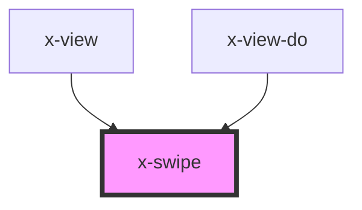

# X-SWIPE

This component is used internally for swipe detection on the route components. Essentially, it detects touch-swipes to perform back & next navigation from the gestures.

## Usage

````html
<x-swipe
  threshold-x="100"
  threshold-y="30"
  time-threshold="30"
  on-touched="(e) => this.handleSwipe(e)}" >
  
</x-swipe>
````

---

Special thanks to [@ranjeetsinghbnl](https://github.com/ranjeetsinghbnl). This component was heavily inspired by his **`<s-swipe>`** component. Check it out: https://github.com/ranjeetsinghbnl/s-swipe

---

<!-- Auto Generated Below -->


## Properties

| Property        | Attribute        | Description                                                   | Type     | Default |
| --------------- | ---------------- | ------------------------------------------------------------- | -------- | ------- |
| `thresholdX`    | `threshold-x`    | How many units must be covered to determine if it was a swipe | `number` | `30`    |
| `thresholdY`    | `threshold-y`    | How many units must be covered to determine if it was a swipe | `number` | `30`    |
| `timeThreshold` | `time-threshold` | The amount of touch-time required before issuing an event     | `number` | `100`   |


## Events

| Event   | Description                                                                           | Type                       |
| ------- | ------------------------------------------------------------------------------------- | -------------------------- |
| `swipe` | Handle the touch start event, store the coordinates and set the timer for touch event | `CustomEvent<ISwipeEvent>` |


## Dependencies

### Used by

 - [x-view](../x-view)
 - [x-view-do](../x-view-do)

### Graph


----------------------------------------------

*Built with [StencilJS](https://stenciljs.com/)*
