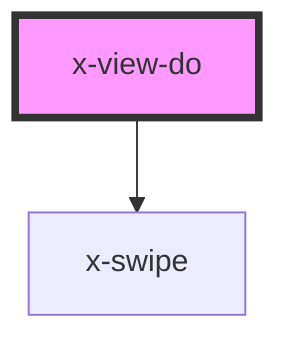

# X-VIEW-DO

[**`<x-view-do>`**](/components/x-view-do) is a specialized child-route that can only exist inside a [**`<x-view>`**](/components/x-view). It represents a sub-route that has special presentation and workflow behaviors. These are the only routes that support audio, video and [event actions](/actions).

> These  are essentially **to-do** items for the parent route. They are used to create presentation, wizards, input workflows, or step by step instructions or wherever you want guided or automatic navigation.

## Usage
Much like its parent, [**`<x-view>`**](/components/x-view), basic routing information is required.

````html
<x-view ...>
  <x-view-do 
    url="<sub-path>"
    page-title="<route title>"
    display="page|modal|full"
    visit="always|once|optional"
    when="<expression predicate>"
    duration="<seconds before next>"
    content-src="<remote html"
    transition="<animation-enter>"
    scroll-top-offset=""
    >
    ...
  </x-view-do>
  ...
</x-view>
````
> The **when** attribute is a data-expression to that overrides the **visit** strategy. It is a predicate that produces a boolean result. <br/>true: visit=always <br/> false: visit=optional 


### How it works:
When the parent [**`<x-view>`**](/components/x-view)'s route is activated, before rendering, it:

1. Lists all direct-child **`<x-view-do>`** items, one at a time in sequence.
2. Finds the first unvisited route respecting the **'visit'** requirement or [**'when'** predicate](/expression), if present.

    * **If found**: It pushes the page state to its url, thus activated the child route.
    * **Otherwise**: The [**`<x-view>`**](/components/x-view) is satisfied and can now render its own contents.

## Samples
The following are some examples to demonstrate how you can combine the settings to create robust workflows.

### Present Once
This route will be activated once for each new  visit to the page. (Visit 'once' is the default behavior, so it can be omitted.)

````html
<x-view-do 
  url="/accept-terms"
  page-title="Consent"
  visit="once">
  ...
</x-view-do>
````

> By default, the visit is 'once'. In this case, the visit is stored in local-storage. Any subsequent visits to this page with the same browser won't see it again. 

### Present Each Visit
This route will be activated once for each new  session visit to the page. 

````html
<x-view-do 
  url="/accept-terms"
  page-title="Consent"
  visit="always">
  ...
</x-view-do>
````

> For **'always'**, the visit is stored in local-session which is destroyed when the browser tab is closed, but retained while on the site.

### Collect Required Data
This route will be activated if a value for 'consent' was not found in local-storage[^1].

````html
<x-view-do 
  url="/accept-terms"
  page-title="Consent"
  when="!{storage:consent}">
  ...
</x-view-do>
````
> **Important**: If a value for `{storage:consent}` is not set in this route's somehow, the user cannot get to the parent page. 

This data can be set manually or using our  specialized declarative components to update data. See [event actions](/actions) for more info.

[^1]: Check out the [data system](/embedded-data) for expressions and how to use external data.

### Optional 
This route will be activated only through navigation. This is helpful for opt-in presentations, modals or other action-based content.

````html
<x-view-do 
  url="/learn-more"
  page-title="Watch a video"
  visit="optional">
  ...
</x-view-do>
````
> **Important**: When linking from a **`<x-view-do>`** to another any other route, you using a **`<x-link>`**, validation and visit tracking is not performed. To mark the current route 'visited', add a **'x-next'** attribute to any clickable element.

#### Special Features:
* Supports [audio](/audio) support:
  * Event-based sounds
  * Background music
  * Voice-overs
* Supports [actions](/actions):
  * At route entrance
  * At a given time
  * At a given user interaction
  * Before route exit 
* Built-in timer & and optional duration:
  * Synced to video (respecting scrub, pause, etc)
  * Based on time elapsed since entrance
  * Hide and show elements at certain times 
  * Time-based animation class toggling
  * Time-based navigation or when the video ends.
* Automatic visibility resolution for child elements using special attributes.
* Automatic next and back handlers for child elements using special attributes.
* Automatic time/percentage value insertion for child elements using special attributes. 


### Routing & Guided Navigation

This evaluation has to take place before the route is activated as the underlying data can change in the previous Do components.  If the component is deemed unnecessary (the predicate returns false), the component marks itself ‘complete’ and returns control to the parent view, without revealing its contents.


### Child Attribute Detection & Resolution
The following attributes are queried to resolve certain data-values or show/hide conditions for all child elements. 

#### Special Next & Back Attributes
To make guided-navigation easy, you can add attributes to set-up event-handlers for next & back.

#### [x-next]

````html
<any x-next />
````

#### [x-back]

````html
<any x-back />
````


#### [x-hide-when]

For each child element with this attribute, the value of the attribute is evaluated for a predicate – and if TRUE, the element is hidden. This evaluation occurs whenever data-changes.

````html
<any x-hide-when="predicate" />
````

#### [x-show-when]

For each child element with this attribute, the value of the attribute is evaluated for a predicate – and if FALSE, the element is shown. This evaluation occurs whenever data-changes. 

````html
<any x-show-when="predicate" hidden/>
````

> ℹ️) To initially hide the element, be sure to include the ‘hidden’ attribute.

### Time-Presentation Child Attribute Resolution
The **\<x-view-do\>** element is always keeping track of time once its route is active. As such, you can create timed-based actions using special attributes placed on any child element.

> ℹ️) If a video element is detected, its time is used, allowing pause & play.

#### [x-in-time] & [x-in-class]
This attribute removes the 'hidden' attribute if present at the specified time in seconds.


````html
<any hidden x-in-time="1" />
````

> ℹ️) To initially hide the element, be sure to include the ‘hidden’ attribute.

When used with x-in-class, this attribute adds the specified class and removes the 'hidden' attribute if present at the specified time in seconds.

````html
<any hidden x-in-time="1" x-in-class="fade-in" />
````

####  [x-out-time] & [x-out-class]
This attribute adds the 'hidden' attribute if  no x-out-class attribute is present at the specified time in seconds. 

````html
<any x-out-time="1" />
````
> ℹ️) To initially hide the element, be sure to include the ‘hidden’ attribute.

When used with x-out-class, this attribute adds the specified class and removes the 'hidden' attribute if present at the specified time out seconds.

````html
<any x-out-time="1" x-out-class="fade-out" />
````

#### Time To:  [x-time-to]
This attribute instructs **\<x-view-do\>** to inject the current time to the named attributes. In this example's case 'value' will be updated.

````html
<any value="" x-time-to="value" />
````

#### Time Percentage To: [x-percentage-to]
This attribute instructs **\<x-view-do\>** to inject the current time percentage (based on the **next-after** attribute or the video-duration) to the named attributes. In this example's case 'value' will be updated.

````html
<any value="" x-percentage-to="value" />
````

<!-- Auto Generated Below -->


## Properties

| Property           | Attribute           | Description                                                                                                                                                                                                          | Type                                                                   | Default              |
| ------------------ | ------------------- | -------------------------------------------------------------------------------------------------------------------------------------------------------------------------------------------------------------------- | ---------------------------------------------------------------------- | -------------------- |
| `contentSrc`       | `content-src`       | Remote URL for this Route's content.                                                                                                                                                                                 | `string`                                                               | `undefined`          |
| `debug`            | `debug`             | To debug timed elements, set this value to true.                                                                                                                                                                     | `boolean`                                                              | `false`              |
| `display`          | `display`           | How should this page be presented (coming soon)                                                                                                                                                                      | `"full" \| "modal" \| "page"`                                          | `'page'`             |
| `duration`         | `duration`          | Set a duration in milliseconds for this view. When this value exists, the page will automatically progress when the duration in seconds has passed.                                                                  | `number`                                                               | `undefined`          |
| `pageTitle`        | `page-title`        | The title for this view. This is prefixed before the app title configured in x-ui                                                                                                                                    | `string`                                                               | `''`                 |
| `scrollTopOffset`  | `scroll-top-offset` | Header height or offset for scroll-top on this view.                                                                                                                                                                 | `number`                                                               | `undefined`          |
| `transition`       | `transition`        | Navigation transition between routes. This is a CSS animation class.                                                                                                                                                 | `string`                                                               | `undefined`          |
| `url` _(required)_ | `url`               | The url for this route, including the parent's routes.                                                                                                                                                               | `string`                                                               | `undefined`          |
| `visit`            | `visit`             | The visit strategy for this do. once: persist the visit and never force it again always: do not persist, but don't don't show again in-session optional: do not force this view-do ever. It will be available by URL | `VisitStrategy.always \| VisitStrategy.once \| VisitStrategy.optional` | `VisitStrategy.once` |
| `when`             | `when`              | If present, the expression must evaluate to true for this route to be sequenced by the parent view. The existence of this value overrides the visit strategy                                                         | `string`                                                               | `undefined`          |


## Dependencies

### Depends on

- [x-swipe](../x-swipe)

### Graph


----------------------------------------------

*Built with [StencilJS](https://stenciljs.com/)*
