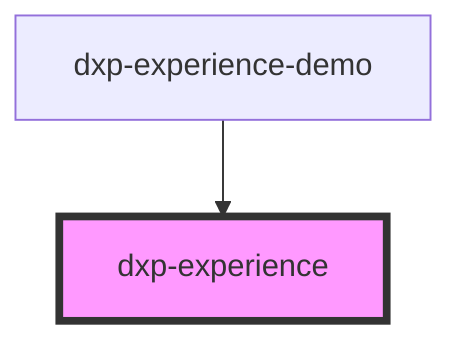

![Built With Stencil](https://img.shields.io/badge/-Built%20With%20Stencil-16161d.svg?logo=data%3Aimage%2Fsvg%2Bxml%3Bbase64%2CPD94bWwgdmVyc2lvbj0iMS4wIiBlbmNvZGluZz0idXRmLTgiPz4KPCEtLSBHZW5lcmF0b3I6IEFkb2JlIElsbHVzdHJhdG9yIDE5LjIuMSwgU1ZHIEV4cG9ydCBQbHVnLUluIC4gU1ZHIFZlcnNpb246IDYuMDAgQnVpbGQgMCkgIC0tPgo8c3ZnIHZlcnNpb249IjEuMSIgaWQ9IkxheWVyXzEiIHhtbG5zPSJodHRwOi8vd3d3LnczLm9yZy8yMDAwL3N2ZyIgeG1sbnM6eGxpbms9Imh0dHA6Ly93d3cudzMub3JnLzE5OTkveGxpbmsiIHg9IjBweCIgeT0iMHB4IgoJIHZpZXdCb3g9IjAgMCA1MTIgNTEyIiBzdHlsZT0iZW5hYmxlLWJhY2tncm91bmQ6bmV3IDAgMCA1MTIgNTEyOyIgeG1sOnNwYWNlPSJwcmVzZXJ2ZSI%2BCjxzdHlsZSB0eXBlPSJ0ZXh0L2NzcyI%2BCgkuc3Qwe2ZpbGw6I0ZGRkZGRjt9Cjwvc3R5bGU%2BCjxwYXRoIGNsYXNzPSJzdDAiIGQ9Ik00MjQuNywzNzMuOWMwLDM3LjYtNTUuMSw2OC42LTkyLjcsNjguNkgxODAuNGMtMzcuOSwwLTkyLjctMzAuNy05Mi43LTY4LjZ2LTMuNmgzMzYuOVYzNzMuOXoiLz4KPHBhdGggY2xhc3M9InN0MCIgZD0iTTQyNC43LDI5Mi4xSDE4MC40Yy0zNy42LDAtOTIuNy0zMS05Mi43LTY4LjZ2LTMuNkgzMzJjMzcuNiwwLDkyLjcsMzEsOTIuNyw2OC42VjI5Mi4xeiIvPgo8cGF0aCBjbGFzcz0ic3QwIiBkPSJNNDI0LjcsMTQxLjdIODcuN3YtMy42YzAtMzcuNiw1NC44LTY4LjYsOTIuNy02OC42SDMzMmMzNy45LDAsOTIuNywzMC43LDkyLjcsNjguNlYxNDEuN3oiLz4KPC9zdmc%2BCg%3D%3D&colorA=16161d&style=flat-square)

# dxp-experience

## Using this component
This component encapsulated all experience interactions. From retrieving by XID, funnel or you can configure it for a static story. 

- Put a script tag in the head of your page:

    ````
    <script type='module' src='https://unpkg.com/@viewdo/dxp-experience-components/dist/dxp/dxp.esm.js'></script>
    ````

- Then you can use the element anywhere in your template, JSX, html etc

    ````
    <dxp-experience xapi-url="https://xapi.view.do/v4"></dxp-experience>
    ````

- Attach to the 'initialized' event to get a handle on the experience data.

    ```
    <script>
      const body = document.querySelector('body');
      experienceTag.addEventListener('initialized', async event => {
        let experience = event.detail;
        await experience.setData('color', 'red');
        console.dir(experience)
      })
    </script>
    ````


<!-- Auto Generated Below -->


## Properties

| Property         | Attribute         | Description                                                                       | Type                                                     | Default        |
| ---------------- | ----------------- | --------------------------------------------------------------------------------- | -------------------------------------------------------- | -------------- |
| `debug`          | `debug`           | Enable Debug mode to prevent API calls. (falls back to ?debug )                   | `boolean`                                                | `url.debug`    |
| `display`        | `display`         | Display mode for this element.                                                    | `"debug" \| "logo" \| "none"`                            | `'logo'`       |
| `experienceData` | `experience-data` | Experience data (bypasses XAPI to retrieve it)                                    | `string`                                                 | `undefined`    |
| `loadAssets`     | `load-assets`     | Enable Debug mode to prevent API calls.                                           | `boolean`                                                | `false`        |
| `namespace`      | `namespace`       | The platform environment target. (optional)                                       | `"develop" \| "local" \| "master" \| "other" \| "stage"` | `undefined`    |
| `preview`        | `preview`         | Enable preview mode to fake data and prevent API calls. (falls back to ?preview ) | `boolean`                                                | `url.preview`  |
| `storyKey`       | `story-key`       | Story Key (falls back to ?storyKey )                                              | `string`                                                 | `url.storyKey` |
| `userKey`        | `user-key`        | User Key (falls back to ?userKey )                                                | `string`                                                 | `url.userKey`  |
| `xapiUrl`        | `xapi-url`        | Experience API Url (optional)                                                     | `string`                                                 | `undefined`    |


## Events

| Event             | Description                                                                                                                                            | Type                      |
| ----------------- | ------------------------------------------------------------------------------------------------------------------------------------------------------ | ------------------------- |
| `dxp:errored`     | When an experience is unable to be retrieved, this event fires with 'event.detail' = error message.                                                    | `CustomEvent<string>`     |
| `dxp:initialized` | When an experience is retrieved, this event fires with 'event.detail' being the full experience, w/ data methods like 'setData()' and 'setComplete()'. | `CustomEvent<Experience>` |
| `dxp:reset`       | This event is raised when reset() is called.                                                                                                           | `CustomEvent<void>`       |


## Methods

### `getExperience(timeout: number) => Promise<Experience>`

This method gets waits for the experience.

#### Returns

Type: `Promise<Experience>`


### `reset() => Promise<void>`

This method resets the stored session-id & experience-key,
effectively resetting the current experience. Useful for testing
or dynamically switching experiences in-page.

#### Returns

Type: `Promise<void>`


## Shadow Parts

| Part          | Description |
| ------------- | ----------- |
| `"container"` |             |


## Dependencies

### Used by

 - [dxp-experience-demo](../dxp-experience-demo)

### Graph


----------------------------------------------

*Built with [StencilJS](https://stenciljs.com/)*
