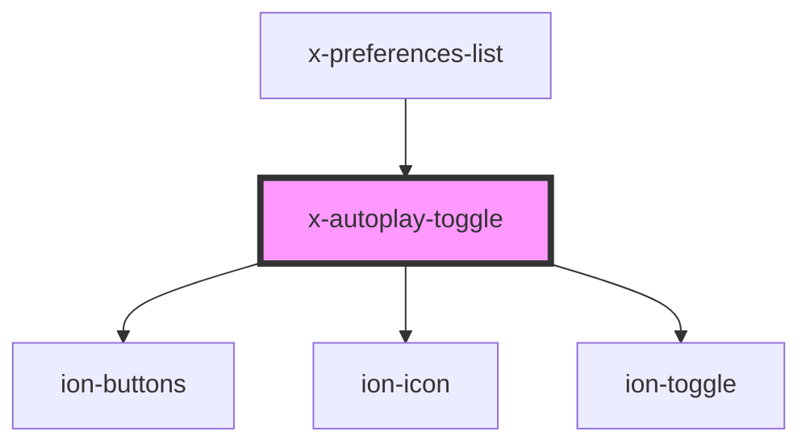

# autoplay-toggle

<!-- Auto Generated Below -->

## Properties

| Property   | Attribute  | Description | Type      | Default     |
| ---------- | ---------- | ----------- | --------- | ----------- |
| `autoplay` | `autoplay` |             | `boolean` | `undefined` |

## Dependencies

### Used by

 - [x-preferences-list](../x-preferences-list)

### Depends on

- ion-buttons
- ion-icon
- ion-toggle

### Graph

----------------------------------------------

*Built with [StencilJS](https://stenciljs.com/)*
