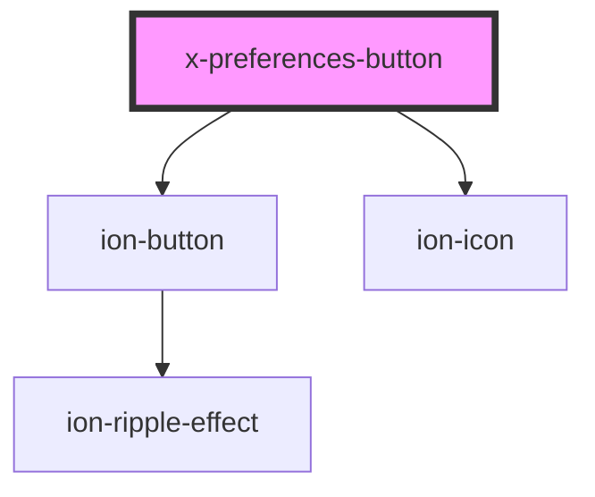

# x-preferences

<!-- Auto Generated Below -->

## Properties

| Property | Attribute | Description | Type     | Default              |
| -------- | --------- | ----------- | -------- | -------------------- |
| `icon`   | `icon`    |             | `string` | `'settings-outline'` |

## Dependencies

### Depends on

- ion-button
- ion-icon

### Graph

----------------------------------------------

*Built with [StencilJS](https://stenciljs.com/)*
