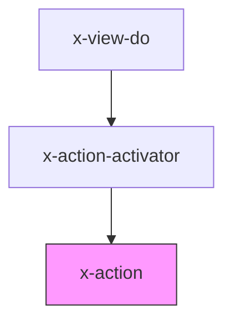

# X-ACTION

This element holds the data that __is__ the Event Action on the XUI Action Bus.

## Usage

This element should only ever exists within a parent **\<x-action-activator\>** tag. The parent tag defines how and when the child actions are submitted to the Action Bus.

#### In-Attribute Data

````html
<x-action-activator ...>
  <x-action
    topic="<topic>"
    command="<command>"
    data='{"arg": "Hello world!"}'></x-action>
</x-action-activator>
````

#### Child Script Data

Alternatively, you define the data parameter in a child script tag.

````html
<x-action-activator ...>
    <x-action
      topic="<topic>"
      command="<command>">
        <script type="application/json">
          {
            "arg": "Hello world!"
          }
        </script>
      </x-action>
  </x-action-activator>
````

## Dependencies

### Depends on

- x-action-activator

### Graph

<!-- Auto Generated Below -->


## Properties

| Property  | Attribute | Description                                              | Type                                | Default     |
| --------- | --------- | -------------------------------------------------------- | ----------------------------------- | ----------- |
| `command` | `command` | The command to execute.                                  | `string`                            | `undefined` |
| `data`    | `data`    | The JSON serializable data payload the command requires. | `string`                            | `undefined` |
| `topic`   | `topic`   | This is the topic this action-command is targeting.      | `"data" \| "document" \| "routing"` | `undefined` |


## Methods

### `getAction() => Promise<ActionEvent<any>>`

Get the underlying actionEvent instance. Used by the x-action-activator element.

#### Returns

Type: `Promise<ActionEvent<any>>`


----------------------------------------------

*Built with [StencilJS](https://stenciljs.com/)*
