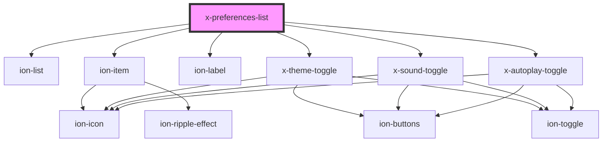

# preferences-list

<!-- Auto Generated Below -->

## Dependencies

### Depends on

- ion-list
- ion-item
- ion-label
- [x-theme-toggle](theme-toggle)
- [x-sound-toggle](sound-toggle)
- [x-autoplay-toggle](autoplay-toggle)

### Graph

----------------------------------------------

*Built with [StencilJS](https://stenciljs.com/)*
