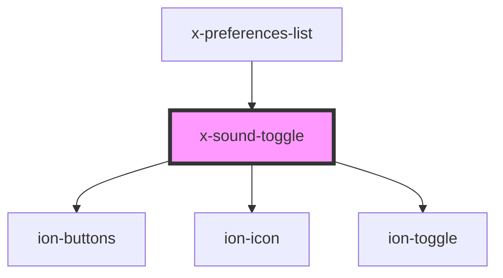

# sound-toggle

<!-- Auto Generated Below -->

## Properties

| Property | Attribute | Description | Type      | Default       |
| -------- | --------- | ----------- | --------- | ------------- |
| `muted`  | `muted`   |             | `boolean` | `state.muted` |

## Dependencies

### Used by

 - [x-preferences-list](../list)

### Depends on

- ion-buttons
- ion-icon
- ion-toggle

### Graph

----------------------------------------------

*Built with [StencilJS](https://stenciljs.com/)*
